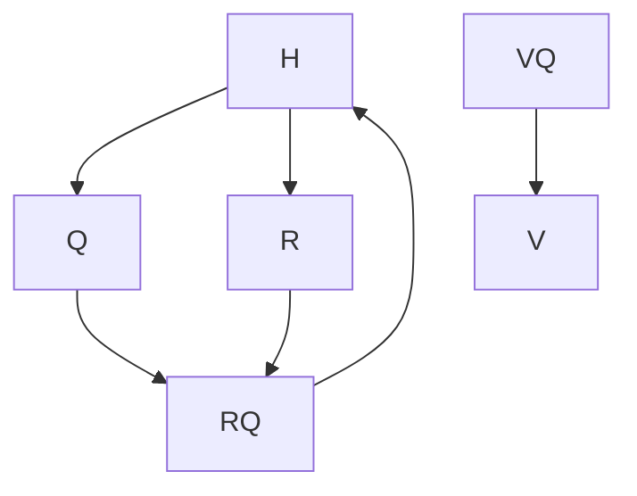

# Multi Implicitly Restarted Arnoldi Method

 Ce projet a été réalisé par DIAS Nicolas, KONÉ Sirata, YEUMO BARKWENDE Chutzpa William dans le cadre d'un projet en Méthodes et Programmation Numérique Avancées en Master 2 Calcul Haute Performance et Simulation à l'université de Paris-Saclay.

## Résumé

Ce programme consiste à une réduction de modèle sur des matrices de grandes tailles afin de récupérer **m** valeurs et vecteurs propres.

## Variables

| Notation              | Description                                           |
| -----------           | -----------                                           |
| rank                  | Rang du processus MPI                                 |
| n                     | Sous espace de krylov                                 |
| m                     | Nombre de valeurs et vecteurs propres souhaités       |
| A                     | Matrice d'origine                                     |
| V                     | Matrice orthnormée                                    |
| H                     | Matrice hessenberg supérieur                          |
| rows                  | Nombre de lignes de A                                 |
| cols                  | Nombre de colonnes de A                               |
| Init_vectors          | Vecteurs aléatoirs                                    |
| Q                     | Matrice issue du QR de H                              |
| f_m                   | Dernière valeurs non-nul de H                         |

## Instruction
### Build

```shell
cd Projet/build
cmake ..
make -j
./test.sh
```
### Utilisation

Pour utiliser ce programme, une matrice doit être fournis en format dense. Le chemin du ficher doit être

## Fonctionnement de l'algorithme

### Projection d'Arnoldi
On part d'une matrice dense A de taille rows * cols. Dans certains cas, il est nécéssaire de récupérer les valeurs et vecteurs propres de matrices de grandes tailles. Pour ce faire on utilisé la projection d'Arnoldi pour créer une matrice H dans un sous espace de krylov de petite tailles.
On obtient alors cette relation : AV<sub>n</sub> = V<sub>n</sub>H<sub>n</sub> + f<sub>n</sub>e<sup>T</sup>.
V<sub>n</sub> est notre matrice qui va nous permettre de faire une transition entre le sous espace de krylov n et l'espace de A.
H<sub>n</sub> est notre matrice hessenberg supérieur résultante de la projection d'Arnoldi. Cependant, sur sa ligne n + 1, elle aura un coefficient non nul. Ce coefficient est notre f<sub>n</sub>. Il nous permet de savoir à quel point on a réussi à réduire A dans notre sous espace.


### Multi Processus

Les processus auront chacun un vecteur de départ différent pour la projection. Ceci va nous permettre d'avoir un f<sub>n</sub> différent par processus. Le processus avec le plus petit coefficient transmettra aux autres sa matrice H<sub>n</sub> et V<sub>n</sub>.

### Algorithme QR

Grâce à cet algorithme on pourra déterminer les valeurs et vecteurs propres dominant de H<sub>n</sub>.
R
: Matrice triangulaire supérieure
Q
: Matrice orthonormée
Jusqu'à ce qu'on converge vers nos valeurs/vecteurs propres recherchées, on répéte à chaque itération le schéma suivant :

Pour calculer Q, on utilise la rotation de Givens, qui nous permet de transformer H en une matrice triangulaire étape par étape.

