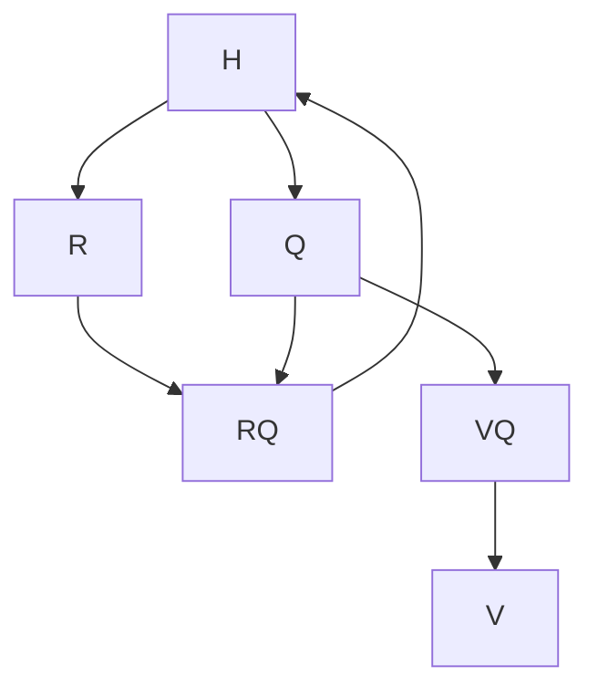

# Multi Implicitly Restarted Arnoldi Method

 Ce projet a été réalisé par DIAS Nicolas, KONÉ Sirata, YEUMO BARKWENDE Chutzpa William dans le cadre d'un projet en Méthodes et Programmation Numérique Avancées en Master 2 Calcul Haute Performance et Simulation à l'université de Paris-Saclay.

## Résumé

Ce programme consiste à une réduction de modèle sur des matrices de grandes tailles afin de récupérer **m** valeurs et vecteurs propres.

## Variables

| Notation              | Description                                           |
| -----------           | -----------                                           |
| rank                  | Rang du processus MPI                                 |
| n                     | Sous espace de krylov                                 |
| m                     | Nombre de valeurs et vecteurs propres souhaités       |
| A                     | Matrice d'origine                                     |
| V                     | Matrice orthnormée                                    |
| H                     | Matrice hessenberg supérieur                          |
| rows                  | Nombre de lignes de A                                 |
| cols                  | Nombre de colonnes de A                               |
| Init_vectors          | Vecteurs aléatoirs                                    |
| Q                     | Matrice issue du QR de H                              |
| f<sub>n</sub>         | Dernière valeurs non-nul de H                         |
| shift                 | Le dernier élément de la diagonale pour QR shifté     |

## Instruction
### Build

```shell
cd Projet/build
cmake ..
make -j
./test.sh
```
### Utilisation

```shell
mpiexec -n <number of processus> ./MIRAM <path to file> <rows> <cols> <number of desired eigen values>
```

## Fonctionnement de l'algorithme

### Projection d'Arnoldi
On part d'une matrice dense A de taille rows * cols. Dans certains cas, il est nécéssaire de récupérer les valeurs et vecteurs propres de matrices de grandes tailles. Pour ce faire on utilisé la projection d'Arnoldi pour créer une matrice H dans un sous espace de krylov de petite tailles.
On obtient alors cette relation : AV<sub>n</sub> = V<sub>n</sub>H<sub>n</sub> + f<sub>n</sub>e<sup>T</sup>.
V<sub>n</sub> est notre matrice qui va nous permettre de faire une transition entre le sous espace de krylov n et l'espace de A.
H<sub>n</sub> est notre matrice hessenberg supérieur résultante de la projection d'Arnoldi. Cependant, sur sa ligne n + 1, elle aura un coefficient non nul. Ce coefficient est notre f<sub>n</sub>. Il nous permet de savoir à quel point on a réussi à réduire A dans notre sous espace.

Algorithme de Gram–Schmidt utilisé pour la projection d'Arnoldi:
```latex
Input : A, rows, cols, Init\_Vectors, n
Output : V, H
for k=1:n
    w = A_k % k-ème colonne de A
    for j = 1:k-1
        r_{jk}=q^{t}_j * w
        w = w - r_{jk} * q_j
    end
    r_{kk} = || w ||_2
    q_k = w / r_{kk}
end
```

### Multi Processus

Les processus auront chacun un vecteur de départ différent pour la projection. Ceci va nous permettre d'avoir un f<sub>n</sub> différent par processus. Le processus avec le plus petit coefficient transmettra aux autres sa matrice H<sub>n</sub> et V<sub>n</sub>.

### Algorithme QR

Grâce à cet algorithme on pourra déterminer les valeurs et vecteurs propres dominant de H<sub>n</sub>.
R
: Matrice triangulaire supérieure
Q
: Matrice orthonormée
Jusqu'à ce qu'on converge vers nos valeurs/vecteurs propres recherchées, on répéte à chaque itération le schéma suivant :

Pour calculer Q, on utilise la rotation de Givens, qui nous permet de transformer H en une matrice triangulaire étape par étape. On calcule les matrices Gi :
$$
G_i =
\left(\begin{array}{cc}
\gamma & -\sigma\\
\sigma & \gamma
\end{array}\right)
$$
$$
\left(\begin{array}{cc}
\gamma & -\sigma\\
\sigma & \gamma
\end{array}\right)
\left(\begin{array}{cc}
a & b\\
c & d
\end{array}\right)
=
\left(\begin{array}{cc}
r & s\\
0 & p
\end{array}\right)
$$
A partir de cette relation on peut déterminer les coefficients de la matrice à gauche :
$$
\gamma = a / \sqrt(a² + b²)
\newline
\sigma = - b / \sqrt(a² + b²)
$$
Il est possible d'overflow ou d'underflow avec cette formule mais on peut facilement éviter ce soucis en normalisant la matrice à triangulariser.
Pour obtenir Q on procède au calcul suivant :
$$
Q^T = G_{n-1} * G_{n - 2} * ... * G_1
$$
Pour une matrice hessenberg de taille quelconque, les Gi ont cette forme :
$$
G_i =
\left(\begin{array}{cc}
1 & 0 & ... & ... & ... & ... & 0\\
0 & 1 & 0 & ... & ... & ... & ... \\
... & 0 & \gamma & -\sigma & 0 & ... & ... \\
0 & ... & \sigma & \gamma & 0  & ... & ... \\
... & ... & ... & ... & 1 & ... & ... \\
... & ... & ... & ... & 0 & ... & ... \\
0 & ... & ... & ... & ... & 0 & 1 \\
\end{array}\right)
$$

### Coefficient de Ritz

Après avoir répeter le processus QR un certain nombre de fois, notre matrice H va converger vers des valeurs prores et notre matrice V va contenir nos vecteurs propres.
Soit u le vecteur propre dominant de H dans l'espace de A, c'est-à-dire la première colonne de V.
$$
\lambda
$$
le vecteur propre dominant de H, soit la première valeur de H.
Pour les déterminer on va calculer :
$$
A * u - \lambda * u
$$
Et regarder relativiser cette différence pour connaitre notre différence relative entre le résultat attendue.
Si cette différence est trop importante, on recommence le processus avec un nouveau vecteur initiale qui sera calculer à partir du f<sub>n</sub> et de des vecteurs propres.

## Crédit

1. Pour toutes information sur GPTune, voir : https://gptune.lbl.gov/about.
2. Nahid Emad and Serge G. Petiton. Unite and Conquer Approach for High Scale
Numerical Computing. J. Comput. Science, 14 :5–14, 2016.
3. S.-A. Shahzadeh-Fazeli, Nahid Emad, and Zifan Liu. A Key to Choose Subspace Size in
Implicitly Restarted Arnoldi Method. Numerical Algorithms, 70(2) :407–426, 2015.

